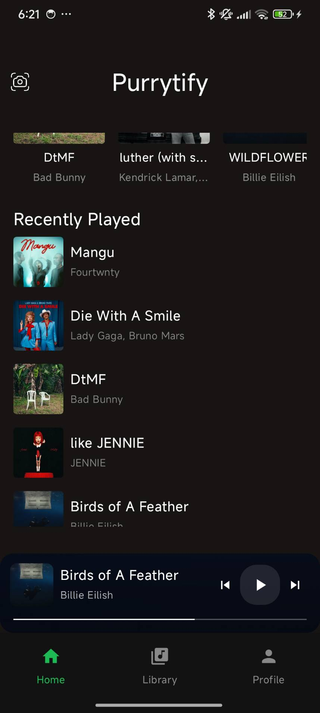

# Purrytify
Purrytify adalah aplikasi Android yang dibangun sebagai klon dari Spotify, menawarkan fitur-fitur inti seperti login pengguna, kemampuan untuk mengunggah dan mengelola lagu lokal, pemutar media yang lengkap dengan kontrol playback dan antrian, mini player untuk kontrol persisten, layar detail lagu, navigasi skip, fungsionalitas favorit dan riwayat putar, serta antarmuka pengguna modern dan responsif yang terinspirasi oleh desain Spotify dan dibangun dengan Jetpack Compose, termasuk pemutaran latar belakang untuk pengalaman mendengarkan yang mulus.

## Library yang digunakan

Android Jetpack Libraries:

    Android Core KTX 
    Android Lifecycle
    Jetpack Compose UI:
    Compose Material 3
    Compose Material Icons Extended
    Android Navigation Component
    Android Room Persistence Library
    Android DataStore
    Android Security-Crypto
    Android WorkManager
    Android Palette KTX
    Android RecyclerView
    Android Core SplashScreen
    Android Activity Compose
Third-Party Libraries:

    Retrofit
    Gson Converter (Retrofit)
    OkHttp Logging Interceptor
    Kotlin Coroutines
    Coil Compose

Kotlin Standard Library:

    Kotlin Script Runtime

## Screenshots

### Home and Library Features

    
    
    

### Profile and User Features

    
    
    

### Music and Album Features

    
    
    

### Additional Features

    
    
    

### Responsive Design

    
    

### Social Features

    

## Pembagian Kerja

| NIM      | Pembagian Kerja    | Jam |
|----------|--------------------|-----|
| 13522136 | Header dan Navbar  | 2   |
| 13522136 | Login              | 2   |
| 13522150 | Home               | 5   |
| 13522129 | Library            | 5   |
| 13522129 | Media Player       | 5   |
| 13522129 | Penambahan Lagu    | 2   |
| 13522150 | Profile            | 3   |
| 13522136 | Liked Songs        | 2   |
| 13522150 | Background Service | 3   |
| 13522129 | Network Sensing    | 2   |
| 13522136 | BONUS - Searching  | 2   |

