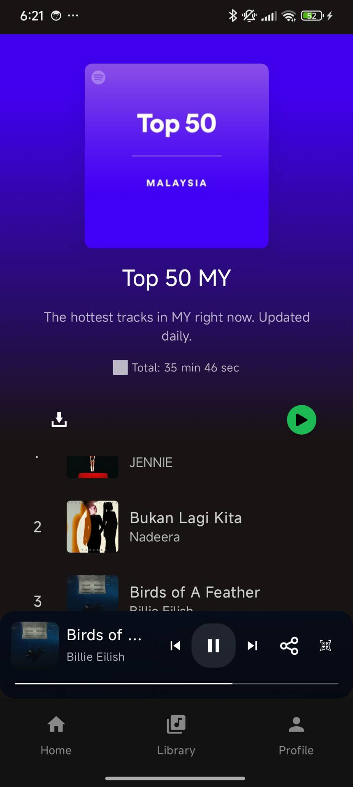
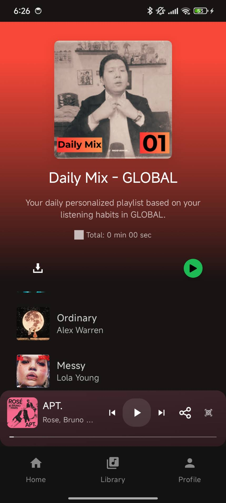

# 🎵 Purrytify

  <h3>🎧 Your Personal Music Companion 🎧</h3>
  
<em>Spotify-inspired Android music player built with modern Android technologies</em>

---

Purrytify adalah aplikasi Android yang dibangun sebagai klon dari Spotify, menawarkan fitur-fitur inti seperti login pengguna, kemampuan untuk mengunggah dan mengelola lagu lokal, pemutar media yang lengkap dengan kontrol playback dan antrian, mini player untuk kontrol persisten, layar detail lagu, navigasi skip, fungsionalitas favorit dan riwayat putar, serta antarmuka pengguna modern dan responsif yang terinspirasi oleh desain Spotify dan dibangun dengan Jetpack Compose, termasuk pemutaran latar belakang untuk pengalaman mendengarkan yang mulus.

## ✨ Features

<table>
  <tr>
    <td width="50%">
      
### 🔐 **Authentication & User Management**
- 🏠 **User Authentication**: Secure login and user profile management
- 👤 **Profile Management**: Customize your personal music profile

### 🎵 **Music Experience**
- 📱 **Local Music Management**: Upload and manage your local music library
- ▶️ **Media Playbook**: Full-featured media player with playback controls and queue management
- 🎛️ **Mini Player**: Persistent playback controls while navigating the app
- 📄 **Song Details**: Detailed view for songs with metadata and controls
- ❤️ **Favorites**: Mark and manage your favorite songs
- 📈 **Play History**: Track your listening history
- 🔄 **Background Playback**: Continue listening while using other apps

    </td>
    <td width="50%">
      
### 🌐 **Advanced Features**
- 📱 **Responsive Design**: Modern UI that adapts to different screen orientations
- 🗺️ **Location Features**: Map integration for music discovery
- 🤝 **Social Features**: QR code sharing and social connectivity
- 📊 **Statistics**: Track your listening habits and preferences
- 💊 **Sound Capsule**: Manage and organize your music collections
- 🌍 **Online Songs**: Stream and download music from online sources
- 🎧 **Audio Routing**: Control output devices and audio settings

### 🔔 **Smart Features**
- 📬 **Notifications**: Stay updated with your music activity
- 🎯 **Recommendations**: Discover new music based on your preferences

    </td>
  </tr>
</table>

## 📱 Screenshots

### 🏠 Core Features

<table>
  <tr>
    <td align="center" width="30%">
      
       <strong>Home Screen</strong>
    </td>
    <td align="center" width="40%">
      
       <strong>Library View</strong>
    </td>
    <td align="center" width="30%">
      
       <strong>Profile</strong>
    </td>
  </tr>
</table>

### 💿 Album Experience

<table>
  <tr>
    <td align="center" width="30%">
      
       <strong>Album View 1</strong>
    </td>
    <td align="center" width="40%">
      
       <strong>Album View 2</strong>
    </td>
    <td align="center" width="30%">
      
       <strong>Album View 3</strong>
    </td>
  </tr>
</table>

### 🎵 Music Controls & Details

<table>
  <tr>
    <td align="center" width="30%">
      
       <strong>Song Details</strong>
    </td>
    <td align="center" width="40%">
      
       <strong>Audio Controls</strong>
    </td>
    <td align="center" width="30%">
      
       <strong>Home Experience</strong>
    </td>
  </tr>
</table>

### 👤 User Features

<table>
  <tr>
    <td align="center" width="30%">
      
       <strong>Profile Management</strong>
    </td>
    <td align="center" width="40%">
      
       <strong>Statistics</strong>
    </td>
    <td align="center" width="30%">
      
       <strong>Notifications</strong>
    </td>
  </tr>
</table>

### ✨ Additional Features

<table>
  <tr>
    <td align="center" width="30%">
      
       <strong>Location Services</strong>
    </td>
    <td align="center" width="40%">
      
       <strong>Social Sharing</strong>
    </td>
    <td align="center" width="30%">
      
       <strong>Profile Details</strong>
    </td>
  </tr>
</table>

### 📱 Responsive Design

<table>
  <tr>
    <td align="center" width="50%">
      
       <strong>Landscape View 1</strong>
    </td>
    <td align="center" width="50%">
      
       <strong>Landscape View 2</strong>
    </td>
  </tr>
</table>

## 🛠️ Technology Stack

<table>
  <tr>
    <td align="center" width="33%">
      <h3>📱 Android Framework & UI</h3>
      <ul align="left">
        <li>🎨 Jetpack Compose</li>
        <li>🎭 Material Design 3</li>
        <li>⚡ Android Core KTX</li>
        <li>🔄 Android Lifecycle Components</li>
        <li>🧭 Navigation Component</li>
        <li>💫 SplashScreen API</li>
      </ul>
    </td>
    <td align="center" width="33%">
      <h3>💾 Data Management</h3>
      <ul align="left">
        <li>🏪 Room Persistence Library</li>
        <li>📦 DataStore</li>
        <li>🔐 Security-Crypto</li>
        <li>⚙️ WorkManager</li>
      </ul>
    </td>
    <td align="center" width="34%">
      <h3>🎵 Media & Graphics</h3>
      <ul align="left">
        <li>🎧 ExoPlayer (Media Playback)</li>
        <li>🖼️ Coil (Image Loading)</li>
        <li>🎨 Palette KTX (Color Extraction)</li>
      </ul>
    </td>
  </tr>
  <tr>
    <td align="center" colspan="3">
      <h3>🌐 Networking & API</h3>
      
🔗 Retrofit • 🌍 OkHttp • 📄 Gson Converter • ⚡ Kotlin Coroutines

    </td>
  </tr>
</table>

## 🏗️ Project Structure

<table>
  <tr>
    <td align="center" width="33%">
      <h3>🎨 UI Layer</h3>
      <ul align="left">
        <li>📱 Compose UI Components</li>
        <li>🎭 Material 3 Design System</li>
        <li>🖌️ Custom Themes and Styling</li>
        <li>🧭 Navigation Components</li>
      </ul>
    </td>
    <td align="center" width="33%">
      <h3>💾 Data Layer</h3>
      <ul align="left">
        <li>🗄️ Room Database</li>
        <li>📋 Repository Pattern</li>
        <li>⚙️ DataStore Preferences</li>
        <li>🌐 Network Services</li>
      </ul>
    </td>
    <td align="center" width="34%">
      <h3>🎯 Domain Layer</h3>
      <ul align="left">
        <li>⚡ Use Cases</li>
        <li>🧠 Business Logic</li>
        <li>📝 Models</li>
        <li>🎵 Media Player Service</li>
      </ul>
    </td>
  </tr>
</table>

## 👥 Development Team

<table>
  <tr>
    <th align="center" width="20%">🎓 <strong>NIM</strong></th>
    <th align="center" width="60%">💼 <strong>Contributions</strong></th>
    <th align="center" width="20%">⏰ <strong>Hours</strong></th>
  </tr>
  <tr>
    <td align="center"><strong>13522136</strong></td>
    <td align="center">🔔 Notifications • 👤 Profile Edit • 🎵 Songs Recommendations</td>
    <td align="center"><strong>20</strong></td>
  </tr>
  <tr>
    <td align="center"><strong>13522150</strong></td>
    <td align="center">🎧 Audio Routing • 📱 Output Device • 🤝 Share Songs (URL & QR)</td>
    <td align="center"><strong>20</strong></td>
  </tr>
  <tr>
    <td align="center"><strong>13522129</strong></td>
    <td align="center">🌍 Online Songs • ⬇️ Download Online Songs • 💊 Sound Capsule</td>
    <td align="center"><strong>20</strong></td>
  </tr>
</table>

---

  <h3>🎵 Made with ❤️ by ITB Students</h3>
  
<em>Bringing music to life with modern Android development</em>

